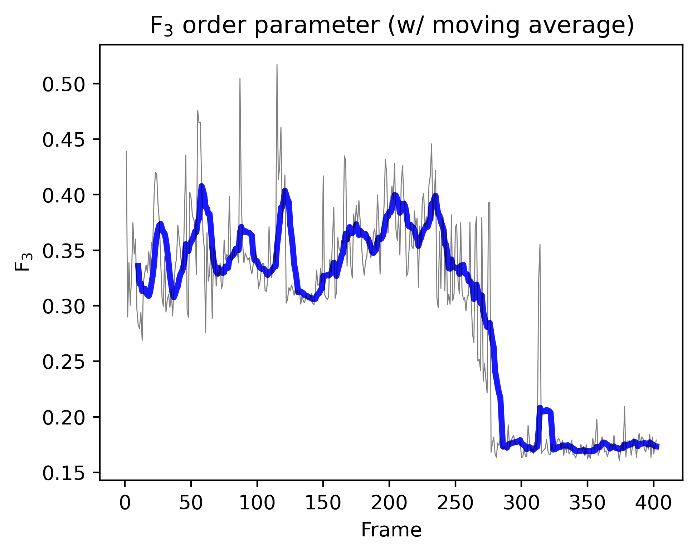

# pyf3
::A Python script to calculate $F_3$ order parameter from GROMACS trajectory::

----

This repository contains a Jupyter Notebook (`f3.ipynb`) that calculates the $F_3$ order parameter.

## Introduction

The $F_3$ order parameter is a measure of the local structure and ordering of water molecules in a given system. It is simliar to my prior repo, entitled [`pyf4`](https://github.com/wjgoarxiv/pyf4/). 

The $F_3$ order parameter is defined as:

$F_3 = \langle (\cos\varphi_{BAC}|\cos\varphi_{BAC}| + \cos^2(104.52^{\circ}))^2 \rangle$

where $\varphi_{BAC}$ is the angle between water oxygen A and two oxygens B and C in its neighbor shell. The value of the angle was set as __104.52°__ since the example GRO file contained _TIP4P 4-site water model_. You can freely change the angle value to 109.5° for the 3-site models like TIP3P, SPC, and SPC/E in the [`f3.ipynb`](f3.ipynb) notebook.

The value of $F_3$ ranges from 0 to 1, with the following interpretations:
- $F_3 \approx 0$: Complete ice or hydrate structure
- $F_3 \approx 0.1$: Liquid water

Since the $F_3$ value cannot be 0 or 1 completely, the changes of $F_3$ values over the trajectory frames can be used to determine the phase transition of water molecules from liquid to ice (or hydrate) and vice versa. 

## Showcases

#### **1. $F_3$ vs. Frame (raw)**
|  |
|:---:|
| You can see the raw $F_3$ values over the trajectory frames. There are some outlier values in some frames. |

#### **2. $F_3$ vs. Frame (w/ rolling avg.)**
|  |
|:---:|
| Rolling average plot (blue line) clearly shows the phase transition of water molecules from liquid-like to hydrate-like structure. |

## Features

- Calculates the $F_3$ order parameter for each frame in a water molecule trajectory
- Plots the raw $F_3$ values over the trajectory frames
- Computes and plots a moving average of the $F_3$ values for smoother visualization

## How to Use
1. Clone the repository to your local machine:
    ```shell
    git clone https://github.com/wjgoarxiv/pyf3.git
    ```

2. Open [`f3.ipynb`](f3.ipynb) in your Jupyter environment.
3. Place your **water molecule trajectory file** (e.g., [`prod_trjconv_SOL.gro`](source_trj/prod_trjconv_SOL.gro)) in the [`source_trj`](source_trj) directory.
4. Run the _**1. Execute this if the `.gro` file has not been segregated**_ section to segregate the trajectory GRO file into separate GRO files (per frame). Check the [`./segregated/`](segregated) folder for the segregated `frame_*.gro` files.
5. Run the _**2. Run and find $F_3$ values per frame**_ section to calculate the $F_3$ order parameter per frame. The output will look like this:
    ```CSV
    1,0.4389346229676665
    2,0.28983631108624514
    3,0.3388557641759112
    4,0.30041182383830684
    5,0.32874678710502075
    6,0.37484584539364757
    7,0.3465822660775157
    8,0.36003490845337816
    ...
    ```
6. Check the generated CSV file named [`frame_f3_values.csv`](frame_f3_values.csv).
7. Run the **3. Plot $F_3$ - frame graph** section to generate plots. You can find the [(1) raw plot](f3_vs_frame_raw.png) and [(2) rolling average plot](f3_vs_frame_rolling.png). It is recommended to use the rolling average plot for your research, as the raw data might contain outlier values outside the expected $F_3$ values for liquid water, ice, or hydrates.

## References

1. [Computer Simulation of the Crystal Growth and Dissolution of Natural Gas Hydrates](https://doi.org/10.1111/j.1749-6632.1994.tb38833.x)

2. [Molecular characteristics of H2O in hydrate/ice/liquid water mixture](https://doi.org/10.1142/S0217979215501854)

3. [A parallel algorithm of F3/F4 order parameters for molecular dynamics](https://zenodo.org/records/5528381)

## License

This project is licensed under the [MIT License](LICENSE).

-------

Feel free to explore the code and adapt it to your specific needs. If you have any questions or suggestions, please open an issue or contact me.

Thank you for your visit!
